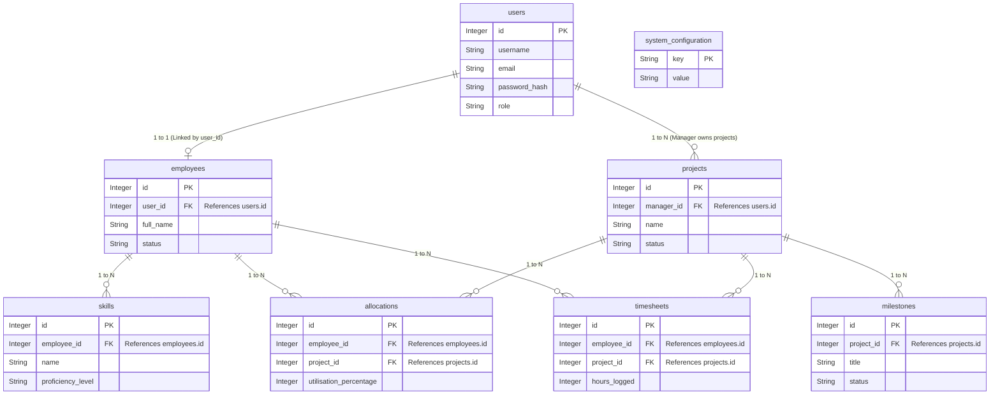

# Database Architecture & Connections

This diagram visualizes how the tables are connected. 
- **PK** indicates a Primary Key (the unique identifier for a row).
- **FK** indicates a Foreign Key (a reference to a Primary Key in another table).
- The lines between the tables indicate the type of relationship (e.g., `||--o{` means "One to Many", `||--o|` means "One to Zero-or-One").

