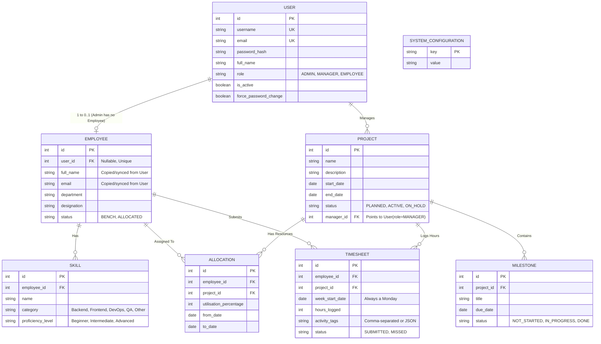

# Database Schema Design for PRM Tool

This document outlines the proposed database schema for the Project & Resource Management (PRM) Tool. The schema is designed to enforce business rules (like avoiding over-allocation) and securely link application access (Users) with business entities (Employees).

## Entity-Relationship Diagram

## Table Definitions & Business Rules

### 1. `User` Table
Handles authentication and authorization.
- **Rules**: `username` and `email` must be unique. The very first Admin is seeded directly into the database. When a Manager or Employee account is created by the Admin, `force_password_change` is set to `true`.
- **Note**: Not every User is an Employee (e.g., the Admin role only exists as a User). 

### 2. `Employee` Table
Represents a physical worker in the company.
- **Link**: Connects to `User` via `user_id` so they can log in.
- **Status Computation**: The `status` field (`BENCH`, `ALLOCATED`) can be automatically calculated by a background scheduler based on the sum of their active `Allocation` percentages on the current date.

### 3. `Skill` Table
Tracks employee capabilities for the AI matching engine.
- **Rules**: `category` and `proficiency_level` use fixed enumerations. This data combined with timesheet `activity_tags` is fed to the LLM to find the best candidate.

### 4. `Project` Table
Represents client or internal work.
- **Link**: Managed by a specific `User` (where role is `MANAGER`). 

### 5. `Milestone` Table
Tracks project health and deliverables.
- **Usage**: Used by the AI Risk Summary feature to check if a project is falling behind (e.g., if a milestone's `due_date` is in the past but `status` is not `DONE`).

### 6. `Allocation` Table
Tracks who is working on what project and at what capacity.
- **Business Rule Enforcement**: When inserting or updating an allocation, the server will check all overlapping allocations (based on `from_date` and `to_date`) for that `employee_id`. If the total `utilisation_percentage` exceeds 100%, the action is rejected.
- **Ending Allocation**: Setting `to_date` to today's date "ends" the allocation and frees up the employee.

### 7. `Timesheet` Table
Logs weekly effort.
- **Business Rule Enforcement**: `hours_logged` cannot exceed `(Allocation % / 100) * SystemMaxWeeklyHours`. 
- **Activity Tags**: The tags provided here serve as real-world evidence of skill usage and are queried by the AI Skill Matcher.

### 8. `SystemConfiguration` Table
Stores global application settings.
- **Rows**: Will contain keys like `LLM_PROVIDER` (Gemini), `LLM_API_KEY`, `SCHEDULER_INTERVAL_HOURS` (e.g., 4), and `MAX_WEEKLY_HOURS` (e.g., 40).
